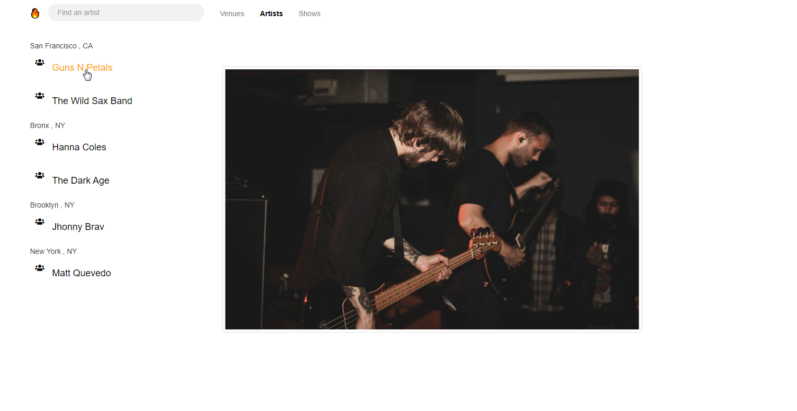
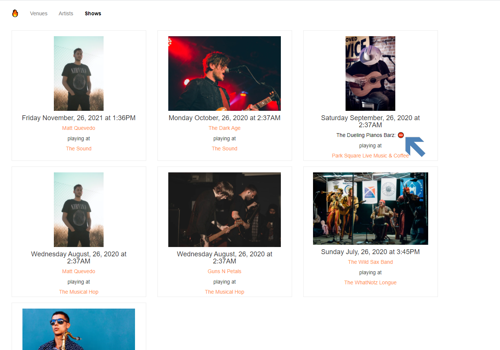

Fyyur
-----

### Introduction

Fyyur is a musical venue and artist booking site that facilitates the discovery and bookings of shows between local performing artists and venues. This site lets you list new artists and venues, discover them, and list shows with artists as a venue owner.

### Functionality

* creating new venues, artists, and creating new shows.
* searching for venues and artists.
* learning more about a specific artist or venue.

We want Fyyur to be the next new platform that artists and musical venues can use to find each other, and discover new music shows. Let's make that happen!

### Tech Stack

Our tech stack will include:

* **SQLAlchemy ORM** to be our ORM library of choice
* **PostgreSQL** as our database of choice
* **Python3** and **Flask** as our server language and server framework
* **Flask-Migrate** for creating and running schema migrations
* **HTML**, **CSS**, and **Javascript** with [Bootstrap 3](https://getbootstrap.com/docs/3.4/customize/) for our website's frontend

### Main Files: Project Structure

  ```sh
  ├── README.md
  ├── app.py ** the main driver of the app. Includes your SQLAlchemy models. "python app.py" to run after installing dependences **
  ├── constants.py ** Database URLs, CSRF generation, etc **
  ├── error.log
  ├── forms.py ** Your forms **
  ├── models.py ** Includes your SQLAlchemy models **
  ├── manage.py ** database configuration and setup **
  ├── requirements.txt ** The dependencies we need to install with "pip3 install -r requirements.txt" **
  ├── static
  │   ├── css 
  │   ├── font
  │   ├── ico
  │   ├── img
  │   └── js
  └── templates
      ├── errors
      ├── forms
      ├── layouts
      └── pages
```
### What functionality does Fyyur provide?

**` Please Note - Pictures below are outdated and will get updated soon. More functionality and changes to styles have been added. Check out the app itself to see.`**
 
**Using Fyyur will give you the ability to search,create,delete,edit,view artist, venues, and or shows!**
- Artist
  - **` As an artist you can:`**
    1. Click the Post an Artist button on the home page and create an artist with the forms provided .
        - 
        - 
    2. Click the find an Artist button on the home page or in the header to get reidrected to the artist view.
        - 
    3. Search for an artist, typing in keywords.
        - 
    4. Hover over an artist name to view the artist image url.
        -  
    5. Click an artist name to be redirected and view more information of the artist.
        -  
        -  
    6. View artist past and or upcoming shows.
        - 
    7. Click on the edit button to edit current artist data.
        -     
        -  
    8. Click on the delete button to delete current artist data. Toast messages will pop up when successfully deleting, editing, creating, and or for errors handling.
        -     
        -   
    9. Post a show with a Venue.
        - 
        -    
        
- Venue
    - **`As a Venue, you can: Repeat of Artist demostration`** 
    
- Shows
  - **` As an user you can:`**
    1. Click the find a show button on the home page or in the header .
        - 
        - 
    2. Click artist or venue links on the show box to view more info .
        - 
        - 
    3. Deleted artist or venues will show on their respected pages displaying artist/venue deleted and or a deleted symbol .
        - 
        
